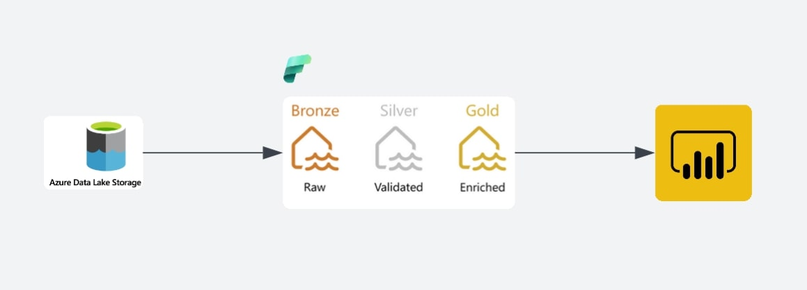
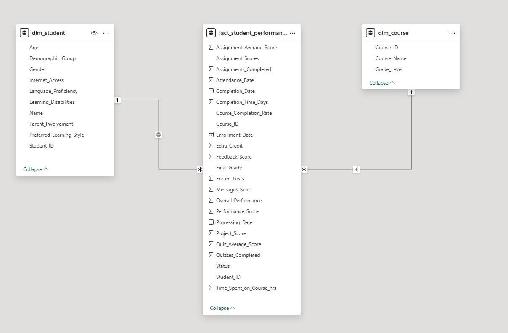
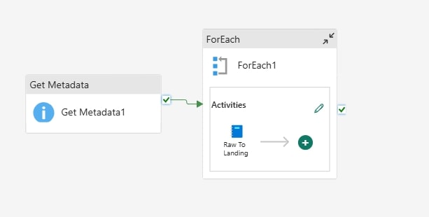

# Online-Learning-Platform-Data-Pipeline-Using-Fabric-Workspace
  Created a data pipeline for an online learning platform involves collecting, processing, storing, and analyzing data generated by users, courses, assessments, and platform interactions. 

 ## Introduction
This project focuses on building a scalable data engineering solution for an online learning platform using Microsoft Fabric Workspace. Leveraging Azure Data Factory for ETL, ADLS Gen2 for data storage, and Lakehouse architecture, we enable unified data access and insights through Power BI reports for informed decision-making.

## Architecture

## Technology Used
1. Programming Language - Python
2. Scripting - SQL
3. Azure Cloud Platform
    - ADLS Gen 2
    - Fabric Workspace
    - Lakehouse
    - OneLake
    - Power BI
## Datasets Used
Here is the data set used - https://github.com/FaizaanMustafa/Online-Learning-Platform-Data-Pipeline-Using-Fabric-Workspace/blob/main/LMS_DATA.csv

## Data Model

## ETL Pipline (Raw To Landing)
In this we have taken the raw data and have ittereated using foreach function so that the raw data moves from raw folder to landing folder. 

